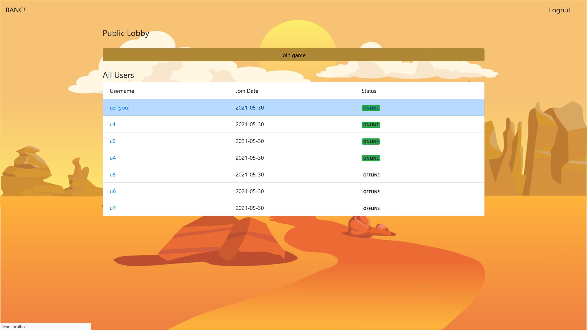
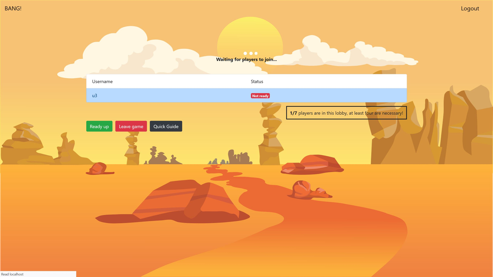
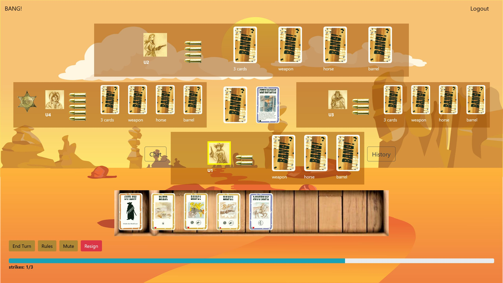
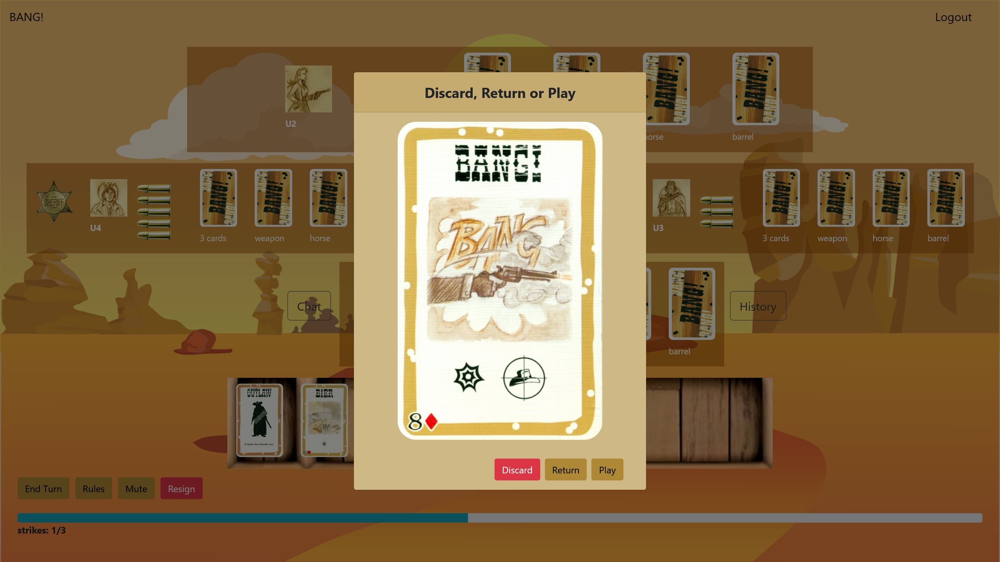
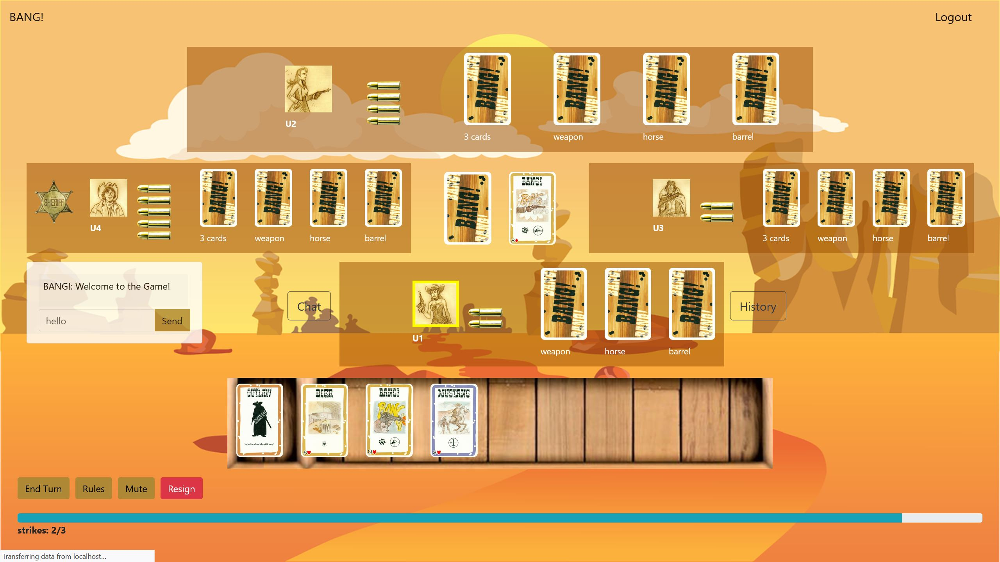
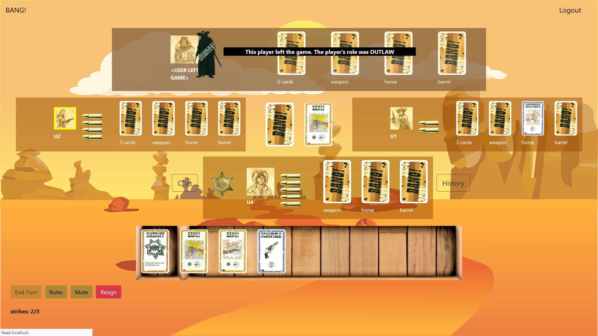
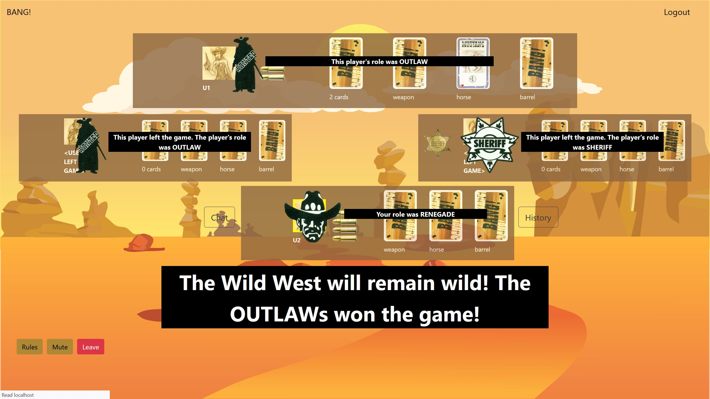

# 21FS Software Engineering Lab (SoPra)
This repository includes the semester project of the course SoPra ([source repository](https://github.com/sopra-fs21-group-22/client)). The code is written in `JavaScript`.

Main packages: `React`, `Bootstrap`

## Introduction
Over the past two months the five of us implemented the card game BANG with 21 different cards, 7 characters, and 4 roles! The main components of the game are the lobby, the game layout, the three steps of each turn, reacting to the other players game moves, and the chat with the external API. All the vital issues were successfully implemented, and even most of the medium- and low-priority issues! 97 frontend issues and 90 issues in the backend were completed.

A quick summary of the game:

There are three different types of cards in the game, character cards, role cards, and playing cards. Character cards and role cards are assigned before the game and stay the same for the entire game duration. Most important are the role cards: SHERIFF, DEPUTY, OUTLAW, RENEGADE. With exception of the SHERIFF, the roles are kept private, and they define the way you play. Additionally, each player has 4-5 lifes in the beginning, depending on the character and the role.
To win the game the players must figure out who has which role and defeat their opponent(s). A player is defeated when all lives are lost. Players can be attacked with the famous “BANG!” card for which there are multiple opportunities to defend. If no defence (BARREL, MISSED, BEER) can be played the player loses a life. By default, players can only attack others seated next to them. However, there are special cards which reduce the distance (e.g. long-range weapons) and enable them to attack players sitting further away. Once the OUTLAWs and the RENEGADE have died, the SHERIFF and DEPUTIEs win. However, if the SHERIFF dies the OUTLAWs win. The RENEGADE only wins when everybody else is dead.

Rules for the game and further information about special cards can be found here: http://www.dvgiochi.net/bang/bang_rules.pdf .

## Technologies
- React: CSS, HTML, Javascript
- GitHub (Actions)
- Heroku
- Bootstrap
- REST API

## High-level Components
main components: [GameDashboard](src/components/game/GameDashboard.js), [WaitingRoom](src/components/game/WaitingRoom.js), [Lobby](src/components/game/Lobby.js)

### GameDashboard
Once registered the user gets pushed to the GameDashboard, where all players, their creation date and their status (offline, online) are listed. The users have the option to click on their username to change it or add a birthdate. Furthermore, there is a button to join a public lobby. This component is used as a landing strip for the users, so they are not directly added to a game.

### WaitingRoom
Once users choose to join a public lobby they are redirected to the waiting room. Here they have the option to ready up which will start the game. Also all the players in the same lobby are listed. This is where the magic happens, all the information gets pulled from the backend and is assigned to the components/hooks (e.g. player table, how the players sit). This component serves the purpose that not all yet undefined elements try to render which would result in an error, which was learned whilst using hooks: they are not assigned in an orderly fashion but just added to a waiting queue. Therefore, if a hook is set and directly called on the next line, the value is not guaranteed.

### Lobby
Once all the players in the lobby are ready, the game automatically starts and they are pushed to the lobby. Here the whole layout is loaded in the background, but not yet visible until the player has picked a role. Hooks are used to assign all the different information about the player and player decks. The visible modals are set with hooks as well. This component serves as the main game platform and is only left once the player resigns/leaves or logs out.

## Launch & Deployment

For your local development environment you'll need Node.js >= 8.10. You can download it [here](https://nodejs.org). All other dependencies including React get installed with:

### `npm install`
For the external text-to-speech API to function correctly the following dependency needs to be installed as well
### `npm install microsoft-cognitiveservices-speech-sdk`

This has to be done before starting the application for the first time (only once).

### `npm run dev`

Runs the app in the development mode. 
Open [http://localhost:3000](http://localhost:3000) to view it in the browser.

The page will reload if you make edits. 
You will also see any lint errors in the console (use Google Chrome!).

### `npm run build`

Builds the app for production to the `build` folder. 
It correctly bundles React in production mode and optimizes the build for the best performance.

The build is minified and the filenames include the hashes. 
Your app is ready to be deployed!

See the section about [deployment](https://facebook.github.io/create-react-app/docs/deployment) for more information.

## Illustrations

First the user needs to register and login. The users are then pushed to the GameDashboard. Once they decide to join a lobby, they are redirected to the WaitingRoom in which they can start the game and finally end up in the lobby. For the rest of the game everything stays in the lobby. Here all the decks (amount depending on the player amount), the discard and deck piles as well as the chat and game log/history are rendered. Hooks are for example set in the lobby and passed down to all components, which need the information. They are also used to make certain modals visible on click or assigned the user's special cards. Bootstrap serves as library from which all kinds of components, such as modals, buttons, grid layouts and carousels are used. Additionally, popovers serve as information for the users as they show up whenever the cursor hovers over them.

## Roadmap
- CSS Wizard to make it look even more classy
- Adding other users as friends
- Private Lobbies

Not knowing CSS was quite the challenge, as it was clear where and how things should look like, but not how to correctly implement it. Slowly but surely however the understanding got better which made it look decent. It is clear that the design could still improve a lot if there were somebody who knows how to correctly use CSS to its full power.

The game as of now can only be played in a public lobby. It would be cool to add the possibility to add other users as friends and then together join a private lobby, which is accessible through a code or link.

## Learn More

To learn React, check out the [React documentation](https://reactjs.org/).
Information about Bootstrap-components can be found [here](https://react-bootstrap.netlify.app/).

## Authors & Acknowledgement
>E. Heggli, M. Mylaeus, R. Bommeli, R. Bättig, Y. Meister

## License

Licensed under GNU General Public License v3.0
- See [License](LICENSE)
